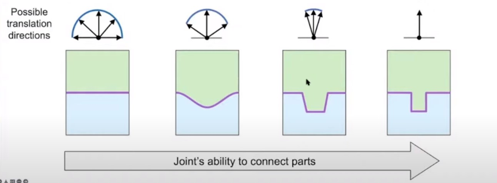

# COMPUTATIONAL ASSEMBLIES NOTES
from video: https://www.youtube.com/watch?v=MhkAYqe2Cpc&list=PLxDzPV8VyVGKAE1xQ3tGZpga8Zal6QLu2&index=2&t=8889s&ab_channel=Eurographics2022

Assemblies:
    an ARRANGEMENT OF PARTS 
    connected by JOINTS 
    have a SPECIFIC FORM and FUNCTIONALITY.
    -> Advantages (compare to Monolithic object): 
        + Simple:
            + fabrication:   
                -> produce in multiple simple pieces, compose to create a complex shape 
            + storage and transport: 
                -> simple pieces shape which is easier to store and minimize breaks when transport 
            + maintenance: 
                if a pieces broke, it's easy to replace 
            + multiple forms: 
            + multiple functionalities: 

        -> Same as [orthogonality](../book_notes/The_Pragmatic_Programming.md) of software development   

Computational Assemblies: 
    includes: 
        + analyzing 
        + designing
        + fabricating 

    Research in Parts:  
        + Fabricability: 
            Each fabrication technique have their strength and weaknesses
            -> Generate a GOOD DECOMPOSITION OF PARTS that best suit for each/combination fabrication technique is very needed

        + Joining: 
            -> create JOINTS that connect parts together into a final product 

            external joint: 
                -> separate joint that connect parts 
            intergral joint:  

                -> the joint is on the part itself

        + Assembly: 
            -> Finding ASSEMBLY SEQUENCE

        + Structural Stability: 
            ...?? 

        + Assembly aesthetics: 
            -> create UNNOTICABLE SEEMS between connected parts

        + Reconfigurability: 
            -> TRANSFORMERSSS

            + free reconfig: 
                no contraints between parts

            + hinged reconfig: 
                have hinges -> have contraints 

        + Reusability: 
            -> a lot of parts have the same shape and can be reuse the connect into different parts -> REUSE MOLD 
                vd: the quads in 3d, it can be reuse to create every shape can be imaged 
                    the lego bricks, the a finite set of blocks but can be use to build anything -> Reuse 
            top-down: 
                input: shape 
                output: set of reusable parts 

            bottom-up: 
                input: set of reusable parts 
                output: shape (approximately)
                vd: computational lego design 

        + Functionality: 
            ....

            
    2 types of Assemblies:
        Structure (the video focus on this):
            Functionality: transfer forces
            Application: furniture, architecture, puzzle
            Typical parts: elongated, planer, solid parts
            Design focus: structural stability

        Mechanism: 
            Functionality: transfer motion and forces
            Application: machine, robot, mechanical toy
            Typical parts: gear, linkage, cam 
            Design focus: kinematic and dynamic performance 

    + Computational Method to: 
        + analyze assemblies: 
            focus on 4 aspects: 
                + fabricability 
                    DEPENDS on selected DIGITAL FABRICATION TECHNIQUES: 
                        Substractive: 
                            + laser cut 
                                pros:
                                    accurate
                                    high speed
                                cons: 
                                    planar (2d) shape only

                            + cnc mill
                                pros: high precision 
                                cons: 
                                    expensive
                                    only 3d height-field shape (pyramidal shape)
                                        -> have to test if the shape is height-field -> expensive 

                        Additive: 
                            3d printing: 
                                pros: produce almost any shape 
                                cons:
                                    require support materials (for 3d shapes with OVERHANGS)
                                        -> overhang detections 

                        -> fidelity(do chinh xac) from high to low: 
                            3d print, cnc mill, laser cut 

                + joining:
                    2 types:
                        Non-Permanent: screws, 3d print joint, woodworking, curved contact 
                            2 types:
                                + external: screws, 3d print  
                                    2 types: 
                                        + Conventional: 
                                        + Customized: 
                                    -> Study customize external joints for connecting a set of given parts/objects

                                + integral: woodworking, curved contact
                                    3 types: 
                                        + Woodworking: 
                                        + Curved contact: 
                                        + Planar contact: 
                                    -> Study customize integral joints for different purpose:
                                        + decoration
                                        + structural stability
                                        + ease of assembly 

                        Permanent: glue, riveting

                    -> connect 2 parts -> by RESTRICTING THEIR RELATIVE MOVEMENT
                    -> Ability to connect parts = Ability to restrict part relative movement
                    .
                    -> Joint Mobility Analysis:
                        Give joint geometry, quantatively compute the part motion space
                        Assume 1 part is fixed, calculate the motion space of the other one 
                        Contraints: avoid collision during the part(the other one) movement 

                + assembly planning
                    -> create instructions to combine separate parts into the final assembly 
                    1. Order to assemble the parts -> assembly sequencing
                    2. Motion to bring each parts to its target pose -> assembly path planning 
                    3. Ultilization of addtional resources (such as supports and tools)

                    -> Disassembly planning:  
                        -> create instruction to disassemble parts from an installed assembly 
                        -> Bijection exist between assembly and disassembly 
                        -> WE CAN GENERATE ASSEMBLY PLAN BY REVERSE DISASSEMBLY  
                        -> Method to Search for Valid Disassembly Plan: 
                            Assumes that the designs allow: 
                                1. Move a single part at a time
                                2. Move parts in a sequence 
                                3. Take out each part directly 

                            Steps: 
                            1. Build a PARTS-GRAPH for a given assembly: 
                                + each NODE represents a PART 
                                + each EDGE represents JOINTS between the two parts
                            2. Compute mobility M(Pi) for each part Pi
                                38:00
                                ....
                                -> calculate the mobility (how moveable the part is) of all the parts 
                                -> the motion to remove the part as well  

                            3. Select a moveable part 
                            4. Remove the part and update the graph 

                        Classification:
                            Sequentiality:
                                -> maximum number of moving sub-assemblies 
                                -> vd: two handed plan, non-sequential plan (three handed plan)

                            Monotonicity:
                                -> need for INTERMEDIATE PLACEMENT OPERATIONS for at least one part of the assembly 

                            Linearity:
                                -> all assembly operations involve MOVING A SINGLE PART with respect to the rest of the assembly

                            Coherence (nhat quan): 
                                -> whether or not each part that is MOVED will TOUCH the rest of the assembly  

                        Disassembly planning is a NP complete problem 
                            -> simplify by focusing on sequential, monotone, linear, coherence disassembly plans
                            -> translational disassembly motion ?? 

                + structural stability: hit by external forces without collapse 
                    How to DEFINE structural stability and ANALYZE it COMPUTATIONALLY ? 
                        list of test (from low stable, highly stable) 
                        -> Static analysis 
                            EQUILIBIRUM under CERTAIN external forces 
                            -> Rigid block equilibrium (RBE) method
                                -> A static equilibrium state means: 
                                    there exists a NETWORK OF INTERACTION FORCES between: the part that can balance the external forces acting on each part 

                        -> Tilt analysis 
                            EQUILIBIRUM under A SET OF LATERNAL forces 
                        -> Interlocking test 
                            EQUILIBIRUM under arbitrary external forces 
                            
        + Design: 
            -> design assemblies to ACHIEVE required OBJECTIVES 

            Most design problem have 2 main components:
                + part's geometry
                + design objectives (muc tieu)

            -> Forward Design framework (Tradtional approach):
                Parameterized geometry get adjusted to achieve objectives (vd: stability)
                -> have enormous design space since each single parameter have to be adjusted many times 
                -> finding one feasible solution is non-trivial 
                -> the problem can have multiple design objectives -> they might be contradicting 

            -> Inverse Design framework (Computational approach)
                Automatically GENERATE assemblies that satisfy design objectives 

                + Discrete geometry (vd: lego): 
                    -> searching algorithm 
                + Continuous geometry: 
                    -> gradient-based algorithm

            Objectives: 
                Assemblability:
                Fabricability:
                Functionality: 
                Stability (the most fundamental requirement): 

            Stability design Workflow: 
                1. General stability optimization framework using the gradient information
                    steps: 
                        1. Geometrical property
                            -> making the unstable stable by CHANGING the part's GEOMETRY 
                            -> Gradient-based Optimization (the MOST COMMON approach to solve the inverse design problem)

                            -> COMPUTE NECESSARY GEOMETRICAL PROPERTIES for stability analysis:
                                + contact points
                                + contact normals
                                + part's centroid (trong tam)
                                + part's volumes (the tich)
                        2. (Impractical)Infeasibility Energy: HOW UNSTABLE the structure is 
                            -> formulate it into a equation to solve  

                        * 1 and 2 -> FORMULATE the problem as an ENERGY MINIMIZATION PROBLEM 

                        3. Sensitivity Analysis 
                            -> compute the Infeasibility energy GRADIENT with respect to the DESIGN PARAMETER
                            -> using chain rule to help compute the gradient  

                        4. Numerical Optimization
                            -> choose which optimization tools to solve the inverse problem: 
                                + Gradient Descend 
                                + Newton Method 
                                + Quasi-Newton Method 

                        * 3 and 4 -> FIND OPTIMAL VALUE of the energy minimization problem

                2. Stability Optimization for GRAVITATIONAL equilibrium
                    Assumption:
                        Parts are rigid body
                        Friction is ignored 
                        The bottom parts are fixed
                    -> Analyse tool: 
                        + RBE (Rigid Body Equilirium) -> output: the structure is balanced or not ? (boolean)

                3. Design for stability under other types of forces
